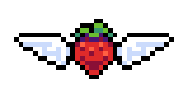

  

<h1 align="center">
    
</h1>

Tec. Info⅔ - IFPI

<h4 align="center">João M. M. Leal</h4>

<h3 align="center">Languages and Tools</h3>

  
 
 

##
  
**📂 Projetos em destaque:**
- [RedatorPro](https://github.com/JMarcosMoura/RedatorPro_Mobile.git)
- [JogoSimples](https://github.com/JMarcosMoura/Jogo-Simples)

**🔗 Conecte-se comigo:**  
- [Instagram](https://www.instagram.com/all.marcoz_art?utm_source=ig_web_button_share_sheet&igsh=ZDNlZDc0MzIxNw==)

    

     

